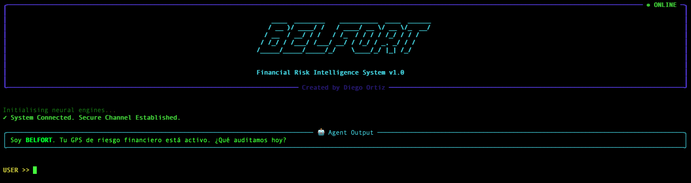

# 🐺 **BELFORT: Financial Risk Intelligence Agent**

Agente de IA para Riesgo Financiero.


> *"Risk comes from not knowing what you're doing."*

**BELFORT** es un Agente de Inteligencia Artificial diseñado para la gestión de riesgo financiero y análisis de carteras institucionales. A diferencia de un chatbot convencional, BELFORT combina **SQL Reasoning** (análisis de bases de datos internas) con **Market Vision** (datos de mercado en tiempo real) para auditar posiciones, detectar anomalías y generar reportes ejecutivos. BELFORT utiliza su propia base de datos **(institutional-radar-engine)** que es un Data Warehouse financiero que fue creado en el último repositorio y tendrá actualizaciones de forma trimestral.

---

## Interfaz (Terminal UI)


--- 
 
## Capacidades Principales

### 1. Deep SQL Reasoning
BELFORT entiende la estructura de bases de datos financieras complejas. Puede realizar consultas avanzadas sobre Holdings, Derivados (Calls/Puts) y Cadenas de Suministro sin necesidad de escribir una sola línea de SQL manual.

### 2. Real-Time Market Vision
Integra **`yfinance`** para cruzar el "Valor en Libros" (base de datos) con el "Valor de Mercado" (precio actual).
* *Ejemplo:* "Analiza mi posición en NVDA. ¿Cuánto ha variado mi exposición real vs. mi registro contable?"

### 3. Risk Assessment Engine
Detecta automáticamente desequilibrios en la cartera:
* Análisis de exposición neta (Bullish vs Bearish) en derivados.
* Identificación de concentración de riesgo en sectores específicos.

### 4. Automated Reporting
Genera documentos PDF listos para la gerencia (`/reports`), resumiendo hallazgos críticos, tablas de datos y conclusiones tácticas con un solo comando.

---

## Tech Stack

* **Core AI:** Google Gemini 2.0 Flash (vía `google-genai`).
* **Orquestación:** Python.
* **Database:** SQLite (Institutional Radar DB).
* **Market Data:** Yahoo Finance API.
* **CLI & UI:** `Rich` (para paneles y tablas), `Typer` (comandos), `Pyfiglet` (ASCII Art).
* **Reporting:** `FPDF2` (Generación de PDFs nativa).

---

## Instalación y Uso

1.  **Clonar el repositorio:**
    ```bash
    git clone [https://github.com/DIEGOAT-7/BELFORT_Financial_Agent.git](https://github.com/DIEGOAT-7/BELFORT_Financial_Agent.git)
    cd BELFORT_Financial_Agent
    ```

2.  **Configurar entorno virtual:**
    ```bash
    python -m venv venv
    source venv/bin/activate  # En Windows: venv\Scripts\activate
    pip install -r requirements.txt
    ```

3.  **Configurar Variables de Entorno:**
    Crea un archivo `.env` en la raíz y añade tu API Key de Google:
    ```env
    GOOGLE_API_KEY=tu_api_key_aqui
    ```

4.  **Iniciar BELFORT:**
    ```bash
    python main.py
    ```

---

## Roadmap

* [ ] Integración con noticias financieras (Sentiment Analysis).
* [ ] Dashboard web con Streamlit/FastAPI.
* [ ] Alertas automáticas vía Email/Telegram.
* [ ] Soporte para bases de datos PostgreSQL/Snowflake.

---

**Autor:** [Diego Ortiz](https://www.linkedin.com/in/diego-ortiz-0ab660256/)
